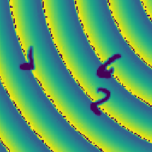

McGill University September 2018 - May 2022  
B.Sc. in Computer Science  
McGill Artificial Intelligence Society

## Employment Experience

### UMAknow

**Software Intern, January 2020 – August 2020**
- Created websites and tools on the **Microsoft Sharepoint** platform
- Developed better documentation reading/writing skills and more rigorous project organization skills, after working with **Microsoft SPFx** and **TypeScript**
- Developed the a platform to handle the recruiting process for the Commission Scolaire de la Baie-James using **Angular**. Also created a platform to handle their expenses and finances using **React**
- Deployed applications on **Azure**
- Developed better coding practices and conventions after being often helped, guided and code-reviewed by more experienced engineers and colleagues.

### CAE
**Software Intern, June 2019 - August 2019**
- Directed and created an internal company tool called [OKR-Tool](https://github.com/xinxin001/OKR-Tool) alone, over the course of 2 months:
  - Web tool used by supervisors to set objectives for their teams and for team members to track and update their progress. It has a **Basic Authentication login**, and other features and metrics requested by the team leader
  - Created front-end using **ReactJS**. Created backend using **NodeJS/ExpressJS**. Deployed on the company private **IIS** server
- Wrote scripts for the company database, added features and removed bugs from company web tools using **C#**
- Familiarized myself with the AGILE and MVC development model and also learned working alongside experienced engineers

## Projects

### Artistic Animals — Web App — McGill Artificial Intelligence Society (WIP) ###
[Github](https://github.com/xinxin001/ArtisticAnimals)  [Blog](/artisticanimals)

- Generates synthetic images of animals using a **Generative Adversarial Network (GAN)**
- Currently attempting to implement BigGAN
- Images can then be transformed into an art style using a **Convolutional Neural Network** style transfer (ex: Picasso)

### Largest Digit Classifier ###
[Github](https://github.com/xinxin001/LargestDigitClassifier)

- Classifier that can detect the largest digit on an image with multiple handwritten digits
- Image data preprocessing using **OpenCV** to remove the noise and augment contrast, Keras to do data augmentation
- Attempted using **Transfer Learning** with VGG16, but ran out of time, used **Convolutional Neural Network** instead
- Accuracy of around 96% with more epochs and data augmentation

### Proper Park — Mobile App — PolyHx 2019 (First Place) ###
[Devpost](devpost.com/software/proper-park-mw0h6e)
- Built an app in a small group as part of Hackatown. Proper Park's goal is to decipher confusing parking signs with a single cellphone snapshot through Machine Learning
- Experimented with **Phone Gap** but settled on **React Native** in order to create the mobile interface for **iOS and Android**

### Legends of Andor — Unity Multiplayer Game ###
[Github](https://github.com/xinxin001/LegendsOfAndor)

- Videogame Adaptation of the board game of the same name
- Implemented multiplayer networking using Photon
- Features of the game:
  - Turn based combat and actions
  - Multiple hero classes the players can choose from
  - Multiple enemy types
  - Usable items, gold, and inventory
  - Main questline, random events, and fog of war

### SafeHouse — Web App — McGill Codejam 2019 (3rd Place IOT) ###
[Devpost](https://devpost.com/software/safe-house)
- SafeHouse uses your home security cameras to detect if any of your doors have been left unlocked and sends you a picture and report through your Google Assistant
- Worked with **Pytorch, FastAI and DialogueFlow**(for Google Assistant)
